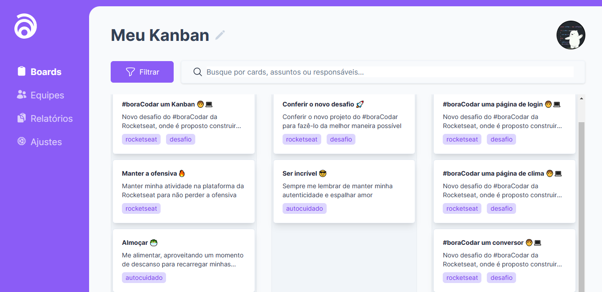

# 📌 Painel Kanban - #boracodar12

## 💻 Projeto

O Kanban é um sistema visual que busca gerenciar o trabalho muito útil para controle de produção e projetos.

Desenvolvido durante o evento #boracodar12

[Acesse o Projeto clicando aqui](https://brendon3578.github.io/boracodar-challenges/12-kanban/src/index.html)

    <kbd>
        
    </kbd>

- Esse projeto foi desenvolvido utilizando o framework TailwindCSS, é possível usar os comandos: `npm install` para baixar as dependências separadamente dentro dessa pasta do projeto e `npm run tailwind` para fazer o processo de build das estilizações do TailwindCSS

## Layout

Acesse o layout do Figma dessa página clicando [aqui](https://www.figma.com/community/file/1243194167725942248/Carrinho-de-compras-%C3%A2%C2%80%C2%A2-Desafio-21/Carrinho-de-compras-%E2%80%A2-Desafio-21)

## ☕ Features

- [x] Utilizar API de Drag and Drop nativo do HTML para realização dos cards (tarefas)

:rocket: Projeto futuro: Dar um upgrade e transformar em uma plataforma funcional de Kanban com equipes e autenticação de usuário
  
---

<h3 align="center">
    Feito por <a href="https://github.com/Brendon3578"> Brendon Gomes</a>
     
    Continue sempre avançando ☕
</h3>
