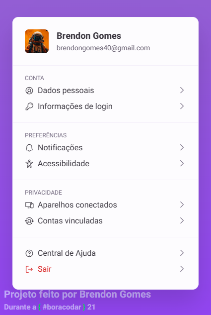

# ⚙ Profile Settings - #boracodar22

## 💻 Projeto

Profile Settings é um componente de configurações de conta de usuário. Ele pode ser utilizado em aplicações desktop, mobile ou web. Em qualquer aplicação de sistema que envolva cadastrar um usuário é essencial ter um modal ou sidebar que tenha esse componente

Desenvolvido durante o evento de #boracodar22

[Acesse o Projeto clicando aqui](https://brendon3578.github.io/profile-settings-twenty-two/)

    <kbd>
        
    </kbd>

## Layout

Acesse o layout do Figma dessa página clicando [aqui](https://www.figma.com/community/file/1245736372337157133)

## ☕ Features

- [x] Responsividade quando usuário diminuir para suporte em dispositivos mobiles
- [x] Estilização para o estado `hover`, quando usuário passar o mouse em cima dos links do componente
- [x] Usuário ser capaz de alterar o Nome e E-mail
- [x] Comportamento de poder alterar a imagem e *setar* uma nova imagem no componente

---

<h3 align="center">
    Feito por <a href="https://github.com/Brendon3578"> Brendon Gomes</a>
     
    Continue sempre avançando ☕
</h3>
