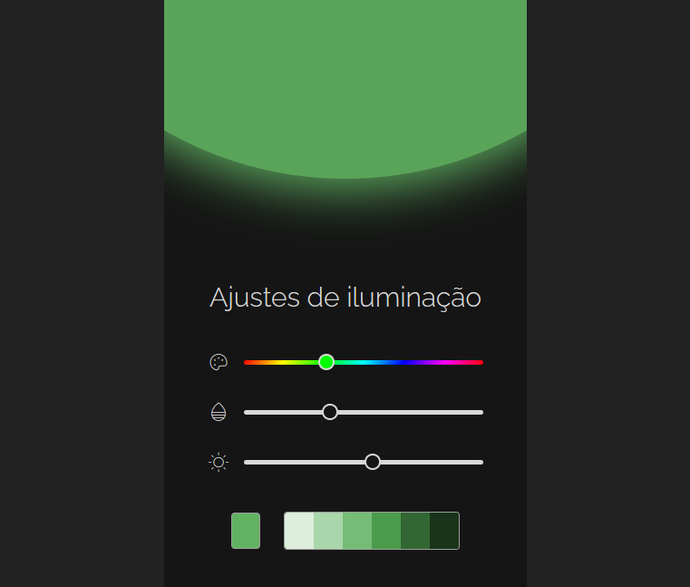

# 🎨 Light Adjustment - #boracodar24

## 💻 Projeto

O componente de **ajustes de iluminação** permite que o usuário possa selecionar diferentes tonalidades de cores que desejar. Para o ajuste dd iluminação foi adotado o sistema de cores HSL, sendo *Hue*, *Saturation* e *Lightness* que representam a tonalidade, saturação e o brilho respectivamente, de uma cor.

O componente também é útil sendo um Seletor de cores, no qual o usuário consegue selecionar uma cor e ver uma paleta de cores com diferentes tonalidades da cor escolhida anteriormente.

Desenvolvido **durante** o evento #boracodar 24

[Acesse o Projeto clicando aqui](https://brendon3578.github.io/boracodar-challenges/24-light-adjustment/index.html)

    <kbd>
        
    </kbd>

## Layout

Acesse o layout do Figma dessa página clicando [aqui](https://www.figma.com/community/file/1250810959627241982)

## ☕ Features

- [x] Utilização do sistema de cor HSL
- [x] Visualização em tempo real (live view) do ajuste de iluminação escolhido pelo usuário
- [x] Possibilidade de alterar a tonalidade (matiz) da cor (hue), a saturação da cor (saturation) e a iluminação da cor (lightness)
- [x] Paleta de cores para visualizar diferentes tonalidades de cores
- [x] Conversão do sistema de cor HSL para Hexadecimal, no qual está visível na paleta de cores  
- [x] Possibilidade de copiar as cores dada paleta, sendo cores com valor de hexadecimal

## 👨‍💻 Desenvolvimento do Projeto

- Primeiro foi decidido qual sistema de cor utilizar baseado no layout do Figma e foi escolhido o sistema de cor HSL que maior correspondia ao layout
- Foi utilizado o pacote de ícone do PhosphorIcons
- Foi utilizado a tipografia Raleway do Google Fonts
- Pesquisado sobre como usar o input range de forma nativa do HTML e como acessar o valor via DOM do javascript
- Pesquisado também como estilizar o input range pelo CSS
- Foi criado um elemento HTML (e estilizado no css através da classe `sr-only`) para aplicativos de leitores de tela para indicar os inputs de range, pos são representados no layout apenas através de ícones
- Utilização de **variáveis CSS** para poder trabalhar com abstrações de cores complexas e trabalhar com variáveis que são utilizadas dentro de outras variáveis CSS.
- Utilização da interface `dataset` do javascript e no HTML (através do atributo `data-*`) para maior facilidade de compreensão e interação de código javascript e HTML
- Foi criado a paleta de cores, e como a maioria de designers trabalha com cores em valores hexadecimais, foi procurado um método de como converter HSL para o sistema de cor hexadecimal
- Foi desenvolvido a funcionalidade do usuário copiar a cor hexadecimal da paleta de cor

---

<h3 align="center">
    Feito por <a href="https://github.com/Brendon3578"> Brendon Gomes</a>
     
    Continue sempre avançando ☕
</h3>
